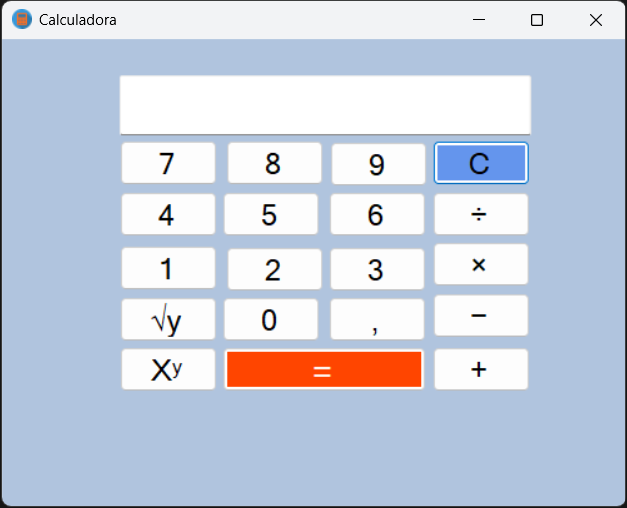
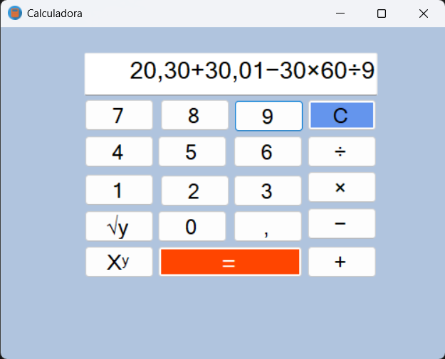

# Calculadora Básica (Semi-Científica) - CP1
 
## Turma
- 2TDSPA
 
## Integrantes
- Fábio Henrique de Souza Eduardo — RM: 560416  
- Gabriel Wu Castro — RM: 560210  
- Renato Kenji Sugaki — RM: 559810  
 
---
 
## Descrição
Este projeto consiste em uma **calculadora básica (semi-científica)** desenvolvida em **C# no Visual Studio 2022**.  
 
A aplicação permite realizar operações matemáticas simples e algumas funções adicionais.
 
---
 
## Funcionalidades
- Botões para inserir números de **0 a 9**  
- Operações básicas: **soma (+), subtração (-), multiplicação (X) e divisão (/)**  
- **Raiz quadrada (√y)**  
- **Exponenciação (x^y)**  
- Botão **igual (=)** para exibir o resultado da operação  
 
---
 
## Tecnologias Utilizadas
- Linguagem: **C#**  
- IDE: **Visual Studio 2022**  
 
---
 
## Interface
**Tela da calculadora**

**Operações**

 
---
 
## Como Executar
1. Abra o projeto no **Visual Studio 2022**  
2. Compile a solução  
3. Execute a aplicação e utilize a calculadora  
 
---
 